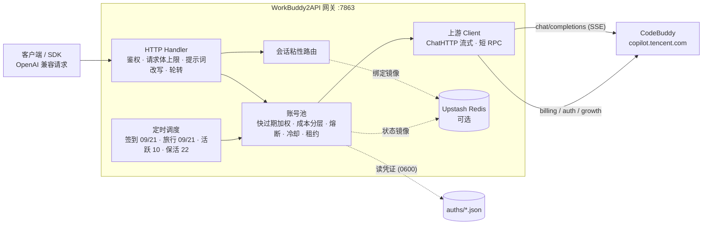

<p align="center">
  
</p>

<h1 align="center">WorkBuddy2API Panel Plus</h1>

<p align="center">
  <b>把腾讯 CodeBuddy 账号变成 OpenAI 兼容 API 的多账号网关 · 附 Web 管理面板</b><br>
  本仓库在上游之上<b>只新增三项功能</b>：🔑 API 密钥分发 · 🧠 模型编排 · 🔌 多协议接入
</p>

<p align="center">
  
  
  
  
</p>

---

## 这是什么

三层 fork，**上游的全部能力一个没动**，只在其上加了密钥分发、模型编排与多协议接入：

| 层 | 项目 | 说明 |
|---|---|---|
| 根项目 | [Sliverkiss/workbuddy2api](https://github.com/Sliverkiss/workbuddy2api) | 账号池调度、错误分类、提示词体系等核心设计 |
| 直接上游 | [linguo2625469/workbuddy2api-panel](https://github.com/linguo2625469/workbuddy2api-panel) | Web 面板与可视化运维层 |
| **本仓库** | `workbuddy2api-panel-plus` | 上游 + 三项增强 |
## 使用声明（必读）

本项目（含上游 [Sliverkiss/workbuddy2api](https://github.com/Sliverkiss/workbuddy2api)，下同）的开发初衷只有一个：**方便个人管理自己的 CodeBuddy 账号**——自动签到、保活、给自己的本地工具提供一个 OpenAI 兼容入口。它是免费、开源、按「原样」提供的个人自用工具。

近期我们发现有人将本项目用于以下行为：

- **批量注册小号 / 收购账号，对外提供付费 API、共享池、代充等业务**；
- **二次加壳、捆绑卡密（授权码）售卖**，或以「公益服」「低价中转」等名义变相收费分发。

我们对上述行为**表达最强烈的反对**，并声明如下：

1. **一切商用 / 售卖行为与本项目及作者无关。** 本项目不授权、不支持、不参与任何面向公众的 API 售卖、账号池出租、卡密收费分发；行为人由此产生的一切后果（包括但不限于账号封禁、条款违约与法律风险）由其自行承担，与作者和贡献者无任何关系。
2. **批量注册与转售接口配额违反目标平台服务条款。** CodeBuddy / 腾讯系服务条款禁止批量注册账号及商业转售接口。上游仓库已删除、停止公开维护——我们无法断定具体原因，但此类滥用行为正在毁掉所有正常使用者的环境，请勿再消耗社区的善意。
3. **请勿购买任何「收费版」「卡密版」「公益中转版」。** 本项目永远免费开源。任何加壳、加密、捆绑收费的「版本」都是他人篡改的产物，与本项目无关；且此类分发无法审计，存在被植入后门、回传并窃取你 CodeBuddy 凭证的风险（`auths/` 中保存的是明文 accessToken / refreshToken）。**你付钱买到的不是本项目，而是把自己账号交给陌生人的机会。**
4. **关于开源协议的诚实说明。** 本项目基于 MIT 协议开源，协议允许自由使用与修改源码——这是开源的本意，我们不会收回；但 MIT 赋予的是代码层面的自由，**不赋予**以本项目名义宣传、售卖、捆绑分发，或要求作者提供支持与背书的权利。作者不为任何第三方分发版本提供支持、更新承诺或安全保证。
5. **作者保留止损的权利。** 若滥用行为持续，作者可能随时停止维护、关闭或删除仓库，且不另行通知。上游的今天可能就是本项目的明天，望自重。

如果你的用途是管理自己的账号，欢迎正常使用、反馈问题与提交 PR。

## 项目简介

WorkBuddy2API 是一个自托管的 **OpenAI 兼容反向代理网关**，将腾讯 CodeBuddy（`copilot.tencent.com`）账号包装为统一的 `/v1/chat/completions` 服务。

- 官方不提供 OpenAI 形态的开放 API，本项目通过 **OAuth 设备授权**（面板「添加账号」或 `login.sh`）获取账号凭证，在网关侧做 token 自动刷新、账号池调度与流量治理；
- 面向 **个人多账号** 场景：多账号共享、单号故障自动换号、冷却 / 熔断防止雪崩、会话粘性保证多轮上下文不跳号；
- 对客户端只暴露 OpenAI 兼容接口，现有 SDK / 前端 / 工具 **零改造接入**。

> ⚠️ 合规须知：本项目是**非官方**网关，使用 CodeBuddy 账号作为上游，**仅限本人授权账号、本机 / 私有环境测试**。详细边界见[安全与合规](#安全与合规)。

## 核心能力

| 能力 | 说明 |
|---|---|
| 🔑 **OAuth 一键登录** | `login.sh` 设备授权流程，自动落盘凭证并重启容器加载新账号 |
| 🔄 **多账号池** | 快过期积分加权 + 成本分层 + 加权随机选号，Top-5 候选 + 防惊群 |
| 🛡️ **熔断与冷却** | 429 软冷却 600s 起指数退避（封顶 `soft_rate_max`）、404 固定 60s 短冷却、402 硬冷却至次日 04:00、连续失败熔断、在途租约限流 |
| 🧲 **会话粘性** | 同一会话（`conversation_id`）尽量绑定同一账号，TTL 滚动续期，失败自动解绑，可镜像 Redis 防重启丢失 |
| ⏰ **定时任务** | 签到（09/21 点，末尾自动跑**连登管家**：兑换已解锁档位 + 抽完抽奖次数）+ 活跃上报（10 点，点亮连登 / 解锁领养 + streak 自检）+ 猫猫旅行（09/21 点，独立排程）+ token 保活（22 点），四类独立开关 |
| ⚡ **流式 + 非流式** | 出站强制 `stream:true`；SSE 帧按规范白名单重建；非流式由本地聚合为单响应 |
| 🧠 **推理模型兼容** | DeepSeek 思维链注入（`thinking.type=enabled` + 默认档）、`reasoning_content` 多轮回填、effort 档位自动降级 |
| 💬 **系统提示词体系** | 网关自有提示词替换客户端 system（默认 `custom`），从源头消灭 system 来源的内容误报；`passthrough` 遇拦截自动降级重试 |
| 🗑️ **指纹脱敏** | 出站请求体黑名单指纹字段清洗（可关闭），与提示词体系两层叠加 |
| 📊 **可观测** | 每请求一行表格日志（TTFB / token 速率 / uid）；`/healthz` 带 `service` 身份标识可接负载均衡 / 宿主探活 |
| 💾 **状态持久化** | 池状态本地原子落盘 + Upstash Redis 异步镜像（可选），重启择新恢复 |
| 🖥️ **Web 管理面板** | 内嵌单页面板（明暗主题），账号运维 / 模型档位查询 / 在线改配置（热生效）/ 运行日志 / 积分任务，见 [Web 管理面板](#-web-管理面板) |

## 🎯 成长任务一键完成（17/18）

官方「成长计划」的 18 个成长任务中，**17 个可在面板上一键纯 API 完成**——无需安装官方客户端、无需人工交互，点一下「一键完成」即自动推进进度、等待异步计分落定并**自动领奖**。剩余任务展示操作指引。

### 任务覆盖与奖励

| 任务 | 奖励 | 一键完成方式 |
|---|---|---|
| `first_buddy` | +300c +8e | 解锁上报 → 同意协议 → 领养第一只 Buddy |
| `create_canvas` | +300c +5e | 设计画布创建事件组（Ardot 遥测） |
| `chat_5` | +100c | 对话活跃上报 ×5（自动补足差额） |
| `Model_chat_GLM5.2` | +100c +5e | glm-5.2 真实对话一次（发一条短消息） |
| `RichMeow_Chat` | +100c +5e +UR Buddy | 桌面端对话事件链（6 事件，含成功回执） |
| `Buddy_App` | +100c +5e | Buddy 应用「发现→进入→授权」事件链 |
| `Buddy_App_QQ` | +50c +5e | 企鹅教师助手进入事件链（与上一条共用） |
| `automation_1` | +100c +5e | 定时任务创建成功事件 |
| `Library_read` | +100c +5e | 资料库阅读点击（web 域上报） |
| `template_5` | +100c +5e | 模板使用事件组 ×5 |
| `playbook_prompt` | +100c +5e | 灵感案例「做同款」发送事件 |
| `expert_5` | +100c +5e | 真实专家召唤+使用链 ×5（专家市场拉真实专家 → 真实对话 → 使用事件） |
| `Expert_team_use_3` | +100c +5e | 专家团召唤+使用链 ×3 |
| `Hp_Appearance` | +100c +5e | 主题设置 + 皮肤生效事件 |
| `Expert_lighthouse` | +100c +5e | 轻量云专家召唤+使用链（真实对话 requestId，**可免费领一个月轻量服务器**） |
| `skill_1` | +100c +5e | 真实对话 + 技能加载事件（skill_info） |

**全新账号一键全做完 ≈ +1950 credits +78 能量**，其中仅数个任务涉及真实对话（`Model_chat_GLM5.2` 一条、`expert_5`/`Expert_team_use_3`/`skill_1` 各数条 fast-model 短对话），其余全部为行为事件上报，零对话消耗。

### 不可自动的 1 个

| 任务 | 原因 |
|---|---|
| `Expert_Philanthropy` | 需真实捐款（服务端领奖时校验捐赠回执，已实测无法绕过） |

### 实现原理（简述）

任务计分走 `/v2/report` 行为上报，但**不同任务认不同客户端指纹**：CLI 指纹（`www.codebuddy.cn`）、桌面指纹（`copilot.tencent.com` + `WorkBuddy/5.5.6` UA + `workbuddy-desktop` 事件族）、web 指纹（`www.workbuddy.cn` + `x-client-platform: web`）。网关为每类任务构造对应指纹的判据事件链（`internal/upstream/desktop.go`）；专家类任务额外要求真实专家 id 与真实对话回执（`internal/upstream/streak.go` 之外的 expert 序列）。上报 200 ≠ 计分——面板在执行后轮询任务进度，达标即自动调用 Web 域领奖接口。

> ⚠️ 行为事件按天幂等：重复点「一键完成」不会重复扣资源，已达标的任务自动跳过。

### 🧭 任务中心（面板新视图）

「任务中心」视图把散落的任务能力收拢成一处：

- **全账号任务扫描**：一键拉取每个账号的成长任务（未完成且可自动化的 19 项，含小程序口径的「校园日」与「小程序首对话」）+ 开学季待办，列表一目了然
- **执行队列**：把待办按账号排队执行——账号内串行（与单任务/一键完成共用互斥锁），账号间可选并发（1-3）；执行进度实时更新到每个条目
- **开学季独立状态卡**：每账号 5 任务（分享/桌面/对话×3/专家/学生认证）的状态矩阵 + 剩余抽奖次数，一键触发全账号闭环
- **日志分频道**：运行日志按「任务 / 对话 / 系统」三个频道筛选——对话流量再大，任务结果也不会被冲掉；日志条目带频道徽标与时间

<details>
<summary><b>🎒 开学季活动（5/5 全自动）</b>——活动期至 2026-09-24，已结束；逆向成果存档，点击展开</summary>

官方「AI 好 Buddy，开学有好礼」小程序活动的 5 个任务**全部纯 API 自动完成**（挂签到排程末尾，幂等）：

| 任务 | 奖励（每日） | 判据（已逆向） |
|---|---|---|
| 分享活动 | +100c +1抽奖 | `share-complete` 直调即点亮 |
| 桌面端体验（单次） | +100c +1抽奖 | viewed 激活 + 真实 chat + 桌面六事件链 |
| 和 AI 对话 3 次 | +50c +1抽奖 | viewed 后 3 条 `chat_request_send` 埋点（无需真实会话） |
| 召唤开学季专家 | +50c +1抽奖 | viewed 后 mp 事件链（召唤×3 + 对话） |
| 学生认证 | +100c | 需微信学生真实认证，不做 |

抽奖次数自动全部抽完。期间逆向成果（cf-connect 加密通道、mp 云对话全链路）记录在 `data/desktop-task-protocol.md` §8。

同一活动在成长任务中心还有两条**小程序口径**任务（`X-Client-Platform: miniprogram` 专属下发，默认列表不可见，各 +100c+5e）：

| 任务 | 判据（已逆向） |
|---|---|
| `school_season` 校园日 | mini `chat_request_send` + `activityId=school_open_day_2026`（无 activityId 不点亮；accept/claim 均要求 mp 头） |
| `Sequential_Tasks_1` 小程序首对话 | mini `chat_request_send`（无 activityId，服务端按 source=mini_program 指纹关联） |

任务中心扫描自动合并 mp 口径待办；accept 带**登记回读验证**（上游存在 200+OK 但未落账的形态，未生效自动重试一次）。

</details>

### 连登兑换与抽奖（自动）

成长中心连登档位（连续登录 7/14/28 天）兑换后发放积分 / 能量 / 补签卡 / **抽奖次数**，抽奖次数只能从兑换获得。网关把它挂在每日签到排程末尾自动跑闭环（见[定时任务](#定时任务)）：档位解锁当天自动兑换、有抽奖次数自动抽完，全程无需人工盯。

## 🆚 与上游的差异

本分支相对 [上游 master](https://github.com/Sliverkiss/workbuddy2api) 的增量（均已在真实多账号环境验证）：

### 新增

| 能力 | 说明 |
|---|---|
| **Web 管理面板** | `internal/panel`，前端 go:embed 单文件进二进制，零外部依赖。账号池可视化（健康色条 / 积分量条 / 冷却倒计时）、积分到期分布、单号运维、批量任务、日志查看、明暗主题 |
| **请求指标与脱敏日志** | 面板展示完成成功率 / HTTP 成功率 / 平均耗时 / 最近请求，响应带 `X-Request-Id`；JSONL 只归档请求元数据，不写提示词、响应正文或凭证。请求记录表带**调用来源**（客户端 IP / User-Agent，按 `logging.request_client_info` 可关），支持按 IP / UA / 模型 / 账号 / 请求 ID 与结果筛选 |
| **浏览器内 OAuth 添加账号** | 面板「添加账号」按钮完成设备授权 → 凭证落盘 → **热加载进池（免重启）**，替代命令行 `login.sh` 流程 |
| **在线配置编辑（热生效）** | 面板直接改 `config.json`：API 密钥 / `soft_rate` / 脱敏开关 / 池参数 / 任务排程**立即生效**；装配期字段（listen 等）保存后提示需重启。写入采用深合并 + 原子替换，保留未知键 |
| **积分任务体系** | 任务列表 / 接受 / 领取接口 + 面板弹窗；「一键完成」覆盖 **17 个任务**（对话 / 领养 / 桌面行为链 / 模板 / 灵感案例 / 画布 / 专家召唤 / 技能尝鲜 / 主题 / 资料库 / 夜猫子等），推进进度、等待异步计分落定后**自动领奖**，纯 API 零客户端依赖 |
| **首启自动生成配置** | 目录下无 `config.json` 时自动生成推荐配置（含 `crypto/rand` 随机 `api_key`），双击即开 |
| **粘性会话内容回退** | 客户端不发 `conversation_id` 时，用 `system + 首条 user` 哈希派生会话键（`d-` 前缀），通用 OpenAI 客户端也能享受粘性 |
| **余额后台刷新** | `schedule.balance_refresh_minutes`（默认 5）周期查余额并更新池，冷却账号余额恢复自动解冻 |
| **模型能力透出** | `/v1/models` 附带 `supported_efforts` / `default_effort` / 积分倍率 / 输入输出上限等上游真实字段 |
| **安全加固** | 常量时间密钥比较（`internal/httpauth`）、CSP 与安全响应头、UID 白名单防路径穿越、前端属性转义修复 |
| **领养前置修复** | 上游 `travelAdopt` 缺 report 前置导致领养恒失败于 `first_buddy task not completed yet`；本分支修正后实测 +300 到账（3/3 账号） |

### 同步上游

**第一轮（fork 基线 `53ee3a1` → `9a87758`，34 个提交）**：四类任务独立排程、pool 文件拆分、12153 连续计数才禁用、429 `code=6004` 模型级限流收窄、11101 不罚号、请求体 413、DeepSeek 思维链、reasoning_content 回填、Codex 指纹脱敏、系统提示词体系、出站 UA 可配等。

**第二轮（`9a87758` → `ea8b1e5`，2026-09-14，只吸收底层）**：

| 上游改动 | 吸收内容 |
|---|---|
| 净化增强 | `tool_calls.arguments` 盲区修复（content=null 的工具调用轮此前完全漏净化）、裸 `11128` 反探测改写、桌面版身份句（逗号形态）漏网修复、反馈句整句改写 |
| 出站头族 | UA 对齐官方三段式 `WorkBuddy/<ver> WorkBuddy/<ver> CLI/<ver>`（默认 5.5.4/2.137.1，可配）；`X-IDE-*` 用量归属四头 + `X-Agent-Purpose`（`client_name` 配 `WorkBuddy` 即对齐官方桌面端）；`X-Device-Token` 设备风控头（auth 每号 / config / 文件三源）；`X-IDE-Version` 补齐 |
| 并发修复 | 客户端 IP 改按请求参数传递（消除共享字段竞态）；billing 单段 UA 形态 |
| 签到幂等 | `IsAlreadyCheckin` 识别"今天已签到"（code=10001/14001），调度日志不再把重复签到当失败 |
| 粘性按模型判活 | 会话绑定的账号被 6004 模型级限额后，换模型请求自动解绑重分配（治"限额后换不动号"）；`/healthz` 探活计入模型豁免形态（治"全号被单模型限流探活误报 503"） |
| report 增强 | `ReportChatActivity` 支持独立 `requestID`（同会话多轮上报各条可区分） |

未吸收（明确不做）：脚本体系（task_runner/school 脚本—我们已有更完整的纯 API 实现）、governance/CI workflow、成本账本选号（依赖 usage.credit 观测，收益待验证）。

> 上游仓库此后已删除，上述第二轮（`ea8b1e5`）即其**删库前的最后一次更新**，本分支已完整吸收。此后本仓库与上游不再有同步关系，演进以本仓库为准。

## 架构总览



账号池调度、冷却熔断、定时任务、成长任务、Web 面板等**上游内容本文档不再复述**，直接看上游 README：

- 全部能力与配置细节 → [上游 README](https://github.com/linguo2625469/workbuddy2api-panel#readme)
- 根项目设计 → [Sliverkiss/workbuddy2api](https://github.com/Sliverkiss/workbuddy2api)

本仓库提交的源码 = 上游功能 + 三项增强，已合并好，`clone` 下来直接就是完整网关 + 面板，不需要先装上游、也不需要先打补丁。

---

## 🚀 快速开始（预构建镜像，开箱即用）

```bash
# 1. 取文件
git clone https://github.com/JACKY199503/workbuddy2api-panel-plus.git && cd workbuddy2api-panel-plus

# 2. 建挂载目录 + 初始配置（缺 config/config.json 容器起不来）
mkdir -p config auths data
cp config.example.json config/config.json

# 3. 属主对齐：容器以 uid 10001 运行，属主不对会 permission denied
sudo chown -R 10001:10001 config auths data

# 4. 起
docker compose up -d

# 5. 浏览器打开 http://<你的机器IP>:7863/ → 面板「添加账号」走 OAuth 登录
```

- 镜像：`ghcr.io/jacky199503/workbuddy2api-panel-plus:latest`（linux/amd64，push 到 main 自动构建）
- 自己编译：注释掉 `docker-compose.yml` 里的 `image:`、放开 `build: .`，或 `docker build -t wb2api .`
- 升级：`docker compose pull && docker compose up -d`（`config/`、`auths/`、`data/` 是挂载目录，不会丢）
- 健康检查：`curl -s http://localhost:7863/healthz`

---
## 配置说明

**`config.example.json` 是配置项最完整的参考**：每个字段、默认值与结构都能在其中找到，示例值一律是 `test_key` 之类占位符，**不含任何真实密钥**。下表为字段含义速查。

### 字段速查

| 字段 | 默认 | 说明 |
|---|---|---|
| `listen` | `:7863` | HTTP 监听地址 |
| `api_key` | 空 | 网关鉴权密钥；**空 = 不鉴权直接放行**（公网必须设置） |
| `auth_dir` | `./auths` | 账号凭证目录 |
| `state_file` | `./data/state.json` | 账号池状态持久化文件 |
| `server.read_timeout` | `300s` | 入站请求读取（含 body 上传）总时长上限；大上下文/文件块经反代转发超时会 400 `read body: i/o timeout`；`0` = 不限制；改动需重启（#100） |
| `panel.package_detail_limit` | `5` | 积分构成页单账号默认展示的最早到期包数；其余未用完包与已用完包聚合折叠 |
| `logging.request_archive_enabled` | `true` | 请求元数据 JSONL 归档开关；不记录提示词、响应正文或 Authorization |
| `logging.request_retention_days` | `7` | 请求归档保留天数；超期文件在启动和周期清理时删除 |
| `logging.request_archive_max_mb` | `100` | 请求归档总容量上限（MiB）；超限优先删除最旧文件 |
| `logging.request_client_info` | `true` | 请求日志是否记录**调用来源**（客户端 IP + User-Agent）：写入 JSONL 归档、stdout 流水行与面板「运行日志」。IP 取 `X-Forwarded-For` 首段 / `X-Real-IP`，无代理头时回落 TCP 对端；UA 截断 200 字节。关闭后来源字段留空（IP 属个人信息，共享部署可关）。**热生效** |
| `cooldown.soft_rate` | `600s` | 软限流（429 / 限流文案）冷却基数；同一账号连续触发按 2 倍指数退避 |
| `cooldown.soft_rate_max` | `2h` | 软冷却指数退避封顶 |
| `schedule.checkin_hours` | `[9, 21]` | 每日本地时区整点签到 + 余额查询解冻。空数组 / `null` = 未配置回落默认（不是禁用） |
| `schedule.travel_hours` | `[9, 21]` | 每日本地时区整点推进猫猫旅行状态机（领养 / 派出 / 领奖） |
| `schedule.activity_hours` | `[10]` | 每日本地时区整点对话活跃上报（点亮连登 + 解锁 `first_buddy`） |
| `schedule.keepalive_hours` | `[22]` | 每日本地时区整点刷新 token 保活 |
| `schedule.blackcat_hours` | `[23]` | 每日本地时区整点夜猫子补足（23:00–08:00 计数窗口） |
| `schedule.checkin_enabled` | `true` | 签到总开关；`false` 真正关闭 |
| `schedule.travel_enabled` | `true` | 猫猫旅行总开关（独立于签到） |
| `schedule.activity_enabled` | `true` | 活跃上报总开关 |
| `schedule.keepalive_enabled` | `true` | token 保活总开关 |
| `schedule.blackcat_enabled` | `true` | 夜猫子总开关 |
| `schedule.include_disabled_in_tasks` | `false` | 让**保号类**四任务（签到 / 活跃上报 / token 保活 / 余额刷新）对**已禁用**账号也执行——「禁用」只关选号，不停保号。`false`（默认）保持「禁用的跳过」 |
| `upstream.timeout_seconds` | `120` | 短 RPC（刷新 / 签到 / 余额 / 模型列表）总时长上限 |
| `upstream.header_timeout_seconds` | 回落 `timeout_seconds` | 聊天首字节前（响应头）上限 |
| `upstream.idle_timeout_seconds` | `300` | 聊天流中空闲上限（活跃续命，静默断流） |
| `upstream.user_agent` | 空 | 出站 User-Agent 覆盖（空 = 现状 `CLI/2.63.2 CodeBuddy/2.63.2`）。官网「使用端」列按出站 UA 服务端归因；官方 WorkBuddy 桌面 UA 为 `WorkBuddy/<version>`，需要时可配 |
| `features.sanitize_blacklist_fingerprints` | `true` | 出站请求体黑名单指纹脱敏 |
| `prompt.mode` | `custom` | 系统提示词模式：`custom` = 网关用自有提示词替换客户端 system；`append` = 开头连续 system/developer 块后插网关提示词（既有消息逐字不动）；`passthrough` = 透传客户端原始 system（降级重试仍切中性提示词） |
| `prompt.file` | 空 | 提示词文件路径；空 = 内置默认（约 2KB）；路径非空但不可读 → 启动报错 |
| `upstash.url` / `upstash.token` | 空 | 空 = 纯内存模式（Noop 降级，功能照常） |
| `pool.max_in_flight` | `3` | 单账号最大在途请求数（`0` = 不限） |
| `pool.max_in_flight_global` | `2` | global 域单账号在途上限（国际版 WAF 风控更紧，压低并发） |
| `pool.degrade_threshold` | `5` | 连败降权阈值：未知错误（ErrClient/传输层）连败 N 次临时出池 |
| `pool.degrade_cooldown` / `pool.degrade_cooldown_max` | `10m` / `2h` | 连败降权时长与上限钳制 |
| `pool.cost_explore_interval` | `30m` | costTier 条件探索窗口：免费层垄断且存在未知号时，每窗口把一个真实请求搭车改道给未知号（零新增上游请求；成功即毕业，失败走既有错误策略）。`0` = 关停 |
| `pool.credit_floor` | `100` | **积分保底**：账号余额低于该值时，对**实测收费**模型（tier 2，账本 6h 内有效观测）不再参与选号——防止收费模型把余额打穿、连免费模型都 402 冷却到次日签到（最坏约 11.5 小时不可用）。tier 0（实测免费）/ tier 1（无观测）**不受限**：保底保的是「留余额给免费模型用」，且 tier 1 若拦会让账本过期 / 重启清零的触底号死锁在「学不回来」。含会话粘性路径（粘性号触底则解绑换号）。全池触底且全 tier 2 时选号返回空（网关回 503），**不放行**。签到回血越过 floor 即刻自动恢复。`0` = 关闭 |
| `pool.breaker_threshold` | `3` | 连续失败触发熔断阈值 |
| `pool.breaker_cooldown` | `30m` | 熔断基础退避时长 |
| `pool.breaker_cooldown_max` | `6h` | 熔断指数退避封顶 |
| `pool.idle_weight_per_hour` | `0.5` | 闲置补偿：每小时未使用 +0.5 权重 |
| `pool.idle_weight_max` | `5.0` | 闲置补偿权重封顶 |
| `pool.prefer_expiring` | `true` | 快过期积分加权：窗口内仍有有效快过期批次的账号，选号权重 ×3（虚拟实例）；不按到期时间排序、与批次金额无关；是软偏好，弱于会话粘性与模型成本分层（#101） |
| `pool.expiring_soon` | `168h` | 快过期加权窗口：仅窗口内仍有有效批次的账号命中上述 ×3；窗口开大 → 命中账号变多、偏好被稀释；留空或 `0` 关闭 |
| `session_sticky.enabled` | `true` | 会话粘性路由开关 |
| `session_sticky.ttl` | `30m` | 会话绑定 TTL（滚动续期） |
| `session_sticky.gc_interval` | `5m` | 过期绑定 GC 周期 |

### 上游超时语义（三段各归其位）

| 字段 | 作用对象 | 默认 | 行为 |
|---|---|---|---|
| `timeout_seconds` | 短 RPC（token 刷新 / 签到 / 余额 / 模型列表） | `120` | 总时长硬上限，到期报错走换号 / 熔断 |
| `header_timeout_seconds` | 聊天 SSE **首字节前** | `120` | 由 `Transport.ResponseHeaderTimeout` 约束；超时 = 换号重发 |
| `idle_timeout_seconds` | 聊天 SSE **流中空闲** | `300` | 活跃吐数据续命不掐；静默超时才断流释放租约 |

聊天流（`stream` true / false 均同）**没有总时长上限**：聊天使用 `Timeout=0` 的专用 client，长思考 / 长输出不会被掐断。

### 环境变量覆盖

加载顺序：JSON 文件 → `WB2A_*` 环境变量（变量非空才覆盖）：

`WB2A_LISTEN` · `WB2A_API_KEY` · `WB2A_AUTH_DIR` · `WB2A_STATE_FILE` · `WB2A_MAX_BODY_MB` · `WB2A_SOFT_RATE`(duration) · `WB2A_SOFT_RATE_MAX`(duration) · `WB2A_TIMEOUT_SECONDS` · `WB2A_HEADER_TIMEOUT_SECONDS` · `WB2A_IDLE_TIMEOUT_SECONDS` · `WB2A_USER_AGENT` · `WB2A_SANITIZE_FINGERPRINTS`(bool) · `WB2A_PROMPT_MODE` · `WB2A_PROMPT_FILE`

## 核心行为语义

### 系统提示词体系

客户端（Claude Code / Codex 等 CLI）会在 system prompt 注入固定模板句，上游内容审核按**逐字精确匹配**误杀合法流量（HTTP 400 + 审核文案）。网关提供两层防护，互不替代：

1. **提示词体系**（解决 **system / developer 来源**的误报）：由 `prompt.mode` 控制
2. **指纹脱敏**（兜底 **用户 / assistant 消息**里的指纹串）：由 `features.sanitize_blacklist_fingerprints` 控制

| 模式 | 语义 |
|---|---|
| `custom`（默认） | 出站前用网关自有提示词**替换**客户端 system / developer 消息（删除全部 system / developer，头部插入单条 system）；user / assistant / tool 消息逐字不动 |
| `append` | 开头连续 system / developer 块之后**插入**一条网关自有 system，既有消息（含客户端项目规范/工具约定）逐字不动——两者并用；降级期退化为 replace（带指纹原文重试只会确定性再撞 400） |
| `passthrough` | 透传客户端原始 system，不做改写 |

内置默认提示词约 2KB（`internal/prompt/defaultprompt.md`，嵌入二进制）。`prompt.file` 指向自定义提示词文件（自定义人格 / 人设）即整体替换内置默认；**留空 = 内置默认**，路径非空但不可读 → **启动报错**（fail fast，不会静默回落到内置默认）。

### 内容拦截误报与降级重试

`passthrough` 模式请求被上游内容策略拦截（HTTP 400 + `blocked by security policy` / `unapproved channel` / `illegal api invocation` 文案）时，判定为 system 指纹误报：**同请求内**换 Degraded 中性提示词重试一次；第二次仍被拦（用户内容本身触发审核）→ 走既有错误路径返回客户端，并如实报给调用方。

- 触发降级后持续到**次日 00:00 CST**（Asia/Shanghai）重置；降级期内 `passthrough` 请求直达中性提示词，不再先撞 400
- 降级状态是**进程内存态**，重启清零
- 内容问题非账号问题：`ErrContentBlocked` 不罚账号（无冷却 / 熔断 / 计错），由网关降级重试消化

### 错误分类与账号处置

上游错误由 `Classify` 统一分类（判定优先级：余额耗尽 → session 失效 → 限流文案 → 状态码兜底），账号处置如下：

| 分类 | 触发条件 | 账号处置 | 恢复 |
|---|---|---|---|
| 余额不足 | HTTP 402 / body 含余额关键词 | 硬冷却到**次日 04:00**（本地时区） | 签到（09/21 点）余额恢复自动解冻 |
| 频控 | HTTP 429 / 限流文案（不限状态码） | 软冷却 `soft_rate`（600s 起，连续触发指数退避，封顶 `soft_rate_max`）。**`code 6004`（模型级）带「将在 … 重置」时**冷却到上游重置墙钟并豁免切模型（见[常见问题](#429-code6004模型级限流的冷却语义)） | 到期自动恢复 / 成功清零退避 |
| Session 失效 | body 含 `Offline user session not found` / `12153` | **连续 3 次**才永久禁用（一次 12153 多为临时抖动：网络 / 闪断 / refresh 竞态）；刷新成功 / 任意成功 / 手工复活清计数 | 人工重新登录（`login.sh`）或 `ReviveDisabled` 复活 |
| 上游 404 | HTTP 404 | 软冷却固定 60s（不随 `soft_rate`、不单独退避） | 到期自动恢复 |
| 服务端错误 | HTTP ≥500 | 喂连续失败计数，达阈值熔断 | 熔断到期 / 成功清零 |
| 请求体解析失败 | HTTP 400 + `Unmarshal chat params failed` / code `11101` | **不罚账号，但仍轮转**（客户端畸形 JSON，换号照样 400） | 即时 |
| 内容拦截 | HTTP 400 + 审核文案 | **不罚账号**，`passthrough` 模式走降级重试 | 即时 |
| 客户端错误 | 其余 4xx / 业务 `code≠0` | 不处罚，换号重试 | 即时 |

请求体解析失败（`11101`）与内容拦截一样**不罚账号**：问题在请求内容而非账号健康。网关不做请求体截断与预拦截，`11101` 均为客户端发来的畸形 JSON。

**熔断器**：所有冷却入口与 5xx 共用唯一连续失败计数器 `fails`；累计达 `breaker_threshold`（默认 3）触发熔断，退避 `breaker_cooldown × 2^retryCount`，封顶 `6h`；成功清零。

**软冷却指数退避**（与熔断器并存的第二条升级线）：软限流的**冷却时长**本身也按连续次数退避——同一账号连续触发软冷却时 `soft_rate × 2^(连续次数-1)`，封顶 `soft_rate_max`。计数 `soft_streak` 独立于熔断器的 `fails`，只在**成功**或**签到解冻**时清零，随 `state.json` 持久化。

### 选号策略

1. 过滤：禁用 / 冷却 / 熔断 / 在途占满账号不参与
2. 按模型实测成本分层，只保留当前最优层
3. 默认开启快过期积分加权（软偏好，不改排序）：

   - 在模型成本最优层内，`expiring_soon` 窗口内仍有有效快过期批次的账号，选号权重 ×3（`expiringVirtualSlots` 虚拟实例展开，会话粘性路径同口径）。
   - 不按到期时间排序、与批次金额无关：14 天后到期与 3 天后到期、1 分与几千分，只要在窗口内待遇相同。
   - 该偏好弱于会话粘性（绑定号健康则直接使用）与模型成本分层（按实测成本硬过滤）；已过期、零余额、无有效到期时间的账号不进入加权集。
4. 同一候选池内加权随机（快过期命中账号在上面的基础上 ×3）：

   `weight = credits 比例 ×10 + idleWeight`

   - `credits 比例` = 该号积分 / 候选集最大积分
   - `idleWeight` = `min(闲置小时 × idle_weight_per_hour, idle_weight_max)`，从未使用给满分
5. 防惊群：跳过 100ms 内刚被选中的账号；全冷却时从非禁用、非余额耗尽的软冷却 / 熔断账号中选最早到期者顶班

### 会话粘性

同一会话尽量复用同一账号，多轮对话不跳号：

- 会话键提取顺序：`metadata.conversation_id` → `metadata.conversationId` → `metadata.user_id` → 顶层 `conversation_id` → 顶层 `conversationId`（snake_case 优先于 camelCase）
- TTL 滚动续期（默认 30m），GC 周期 5m；绑定可镜像到 Redis（7 天 TTL）防重启丢失
- 请求失败自动解绑；成功后绑定跟随最终成功账号

### 定时任务

五类任务各自独立排程、各有开关，互不影响。容器时区由 `TZ` 控制（compose 默认 `Asia/Shanghai`）。

| 任务 | 开关（默认 true） | 时刻（默认） | 行为 |
|---|---|---|---|
| 签到 | `schedule.checkin_enabled` | `checkin_hours` `[9, 21]` 整点 | 签到 + 余额查询；余额恢复则解冻冷却账号。**末尾追加连登管家**（见下） |
| 活跃上报 | `schedule.activity_enabled` | `activity_hours` `[10]` 整点 | 对话活跃上报（`chat_request_send` 事件，必须含 `userId`）；点亮连登 + 解锁 `first_buddy`；每号每天 1 次 |
| 猫猫旅行 | `schedule.travel_enabled` | `travel_hours` `[9, 21]` 整点 | 独立排程：无猫领养 / `idle` 派出 / `arrived` 领奖 |
| 保活 | `schedule.keepalive_enabled` | `keepalive_hours` `[22]` 整点 | 全账号刷新 token；session 失效**连续 3 次**才自动禁用 |
| 夜猫子 | `schedule.blackcat_enabled` | `blackcat_hours` `[23]` 整点 | **先查任务进度再决定**：`black_cat` 未达标才在 23:00–08:00 计数窗口内补足 glm-5.2 短对话（每天 1 次累计 3 天，漏跑次日窗口自动补） |

#### 禁用账号与保号任务（`schedule.include_disabled_in_tasks`）

缺省 `false`：禁用账号被上述**签到 / 活跃上报 / 保活 / 余额刷新**四任务跳过，与选号过滤一致。

面板「禁用」的语义是「**不再参与选号**」，但这四类任务此前会一并跳过禁用号——被禁用的账号因此拿不到签到积分、不续 token、余额也不再刷新；而 `ReenableIfCredits` 明确不复活 disabled 账号，等于签到这条唯一的自动回血路径也断了，只能人工点「解冻」。

如果采用「**一次只放开一个账号、用禁用做流量开关**」的轮换方式（同 IP 多号怕触发风控），闲置待命的号恰恰是最需要签到的——把它设为 `true`，禁用号仍会签到 / 保活 / 刷新余额，**但依旧不参与选号**（`pool` 选号侧的 disabled 过滤不受本开关影响）。

> 该开关**只覆盖调度器的这四类任务**。猫猫旅行、夜猫子、连登管家（挂在签到末尾的 `RunStreakBonusNow`）与成长任务队列**仍按原样跳过禁用账号**——若也需要，请另行提出。

#### 暂停选号（账号级 `paused`，无需配置）

比上面的全局开关更常用的账号级入口：面板账号行的「**暂停选号**」按钮。暂停的账号：

- **退出选号**（含全冷却兜底），状态显示「已暂停选号」，点「恢复选号」即刻回池——不清冷却域、无需解冻或重登；
- **无条件照常保号**：签到 / 活跃上报 / 保活 / 余额刷新四任务照跑（不依赖 `include_disabled_in_tasks`）；
- **其余任务体系照常**：猫猫旅行（纯 RPC：状态/派出/领奖）、连登管家、成长任务队列与任务中心扫描/执行都照常参与——这些走的是上报/领奖接口，不发模型对话（个别任务动作自带一次真实短对话，如 `Model_chat_GLM5.2`，影响可控）；失败照常记错误行，不特殊处理；
- **唯一跳过的是夜猫子**：`RunNightChats` 逐条发真实 glm-5.2 对话，是任务体系中唯一「整任务都是模型对话」的，与「让位防风控」正面冲突。

这正是「一次只放开一个号、其余让位」轮换用法想要的粒度：让位的号不再承接**选号流量**，也避开夜间的对话补足；其余养号动作照常。与「禁用」的区别：禁用是终态（session/授权判死，需人工解冻，保号默认也停），暂停是运维临时态（账号健康，随时恢复）。状态持久化（state.json `paused` 字段），跨重启不丢；`disable`/`revive` 会一并清掉 `paused`。

#### 连登管家（签到排程末尾自动执行）

成长中心的连登档位（连续登录 7/14/28 天）兑换后发放积分 / 能量 / 补签卡 / **抽奖次数**，抽奖次数只能从兑换获得。管家在每日签到后自动跑一遍闭环（幂等，未解锁静默跳过）：

1. 查连登档位状态 → 已解锁（非 locked / 非 claimed）的档位自动**兑换**
2. 查抽奖次数 → **有次数自动全部抽完**，奖品记日志（`streak-bonus <uid>: 🎲 …`）

无需配置，跟随签到排程；到天数那天自动完成「兑换 → 抽奖」，无需人工盯。

**关闭定时任务**：用 `schedule.*_enabled: false` 显式关闭（四个都设 `false` 则调度器不空转，直接阻塞等待退出信号）。注意两点语义：

- **空数组与 `null` 表示「未配置 → 回落默认」**，不是「禁用」；真正关闭请用 `*_enabled: false`
- **禁用不会擦除小时配置**：`*_hours` 原样保留，改回 `true` 即恢复原时点；小时值必须是 0-23，非法值启动即报错
- 关签到会把「余额恢复即解冻」一起关掉，被硬冷却的账号只能等次日 04:00 自然到期

#### 活跃上报（独立排程）

## 🆕 新增一：API 密钥分发（子钥匙）

**解决什么问题**：原来全站只有一把管理员钥匙 —— 要么不给人用，要么给人用就等于把全部权限交出去。现在可以按需签发子钥匙，每把自带额度和边界，随时停用、随时改额度。

**在哪操作**：面板左侧 **API 密钥** 页 → 右上角「新建密钥」。列表里每一行都能直接停用、改额度、看用量。

**一把钥匙能限制什么**（都在新建窗口里填，填 0 或留空 = 不限制）

| 窗口里的项 | 作用 |
|---|---|
| 密钥名称 | 用来区分用途，必填 |
| 版本归属 | 限定这把钥匙只能走国内版或国际版，默认不限 |
| 有效期（天） | 到期自动失效，填 0 = 长期有效 |
| 最大来源 IP 数 | 限制最多允许几个不同 IP 用过这把钥匙 |
| Token 用量上限 | 用超了就拒绝 |
| 积分用量上限 | 用超了就拒绝 |
| 来源 IP 白名单 | 只允许名单内的 IP 调用，支持网段写法 |
| 模型白名单 | 只允许调用名单内的模型（含虚拟模型 `auto`），留空 = 全部放行 |

钥匙明文以 `wbk_` 开头，**只在创建弹窗里显示这一次**，关掉就找不回来了 —— 服务端只存它的摘要，不存明文，谁也捞不出来。

带 `wbk_` 前缀的钥匙走这套判定，其余的仍按原来的管理员钥匙校验。**一把子钥匙都不建的话，跟以前完全一样**。

---

<a id="model-orchestration"></a>

## 🆕 新增二：模型编排（auto · 免费额度薅满 · 昼夜自动切换）

**一句话目的**：把每天能白嫖的额度尽量用满；免费窗口过期、额度波动、被限流时**自动**换模型，全程不用手动改配置。

**怎么触发**：得先在面板「配置」页 →「模型编排」那里打开「启用模型编排」开关并点「保存配置」，然后请求里模型名传下面这几种，网关才会接管：

| 你传的模型名 | 结果 |
|---|---|
| `auto` | 交给编排：按当前钟点在「白天主模型」和「夜间主模型」之间挑，降级链不挑版本 |
| `cn:auto` | 交给编排，但降级链只保留国内版模型 |
| `global:auto` | **默认配置下不生效** —— 面板里填的主模型和降级链全是国内版，没有国际版候选，这个名字会原样发给上游（基本上是 404）。想让国际版也编排，先往「降级链」里加国际版模型 |
| `cn:hy3`、`cn:deepseek-v4.1-flash` 这类具体名字 | 就是那个模型，原样透传，不参与编排 |

上面几行提到的「白天主模型」「夜间主模型」「降级链」，就是面板「配置」页 →「模型编排」里那几个输入框，改完点「保存配置」立刻生效，不用重启。

三个接口都认这几种写法。模型列表里能查到的虚拟名是 `auto` 和 `cn:auto` 两个。

- **按钟点自动换主模型**：白天吃白天的免费额度，夜里吃夜里的免费窗口，到点自动切回。
- **出问题自动往下顶**：首选模型被限流 / 积分耗尽 / 上游报错 / 返回空正文，就按降级链往下挑下一个能用的。
- **优惠到期不用管**：链是按「免费 → 低倍率 → 兜底」排的，免费额度没了自然落到下一个，配置一行不用动。

### 自动切换逻辑

下面是面板里的默认配置，每一项都能在「配置」页 →「模型编排」里改：白天主模型、夜间主模型、白天窗口（起 / 止 小时，按北京时间）、降级链（逗号分隔，按顺序尝试）。

| 时段 | 首选模型 | 首选不行就依次往下试 |
|---|---|---|
| **白天 08:00–23:00** | `cn:hy3`（免费） | `cn:deepseek-v4.1-flash`（0.03x）→ `cn:glm-5.3-flash`（0.06x，1M 上下文、能看图）→ `cn:hy3-x`（0.05x，兜底） |
| **夜间 23:00–08:00** | `cn:hy4-preview`（夜间老用户免费窗口） | `cn:hy3` → `cn:deepseek-v4.1-flash` → `cn:glm-5.3-flash` → `cn:hy3-x` |

- 切换**不是定时任务**：每次请求进来按当前钟点判定，08:00 一到请求自然回到 `cn:hy3`，无需重启、无需改配置。
- 白天主模型 `cn:hy3` 本身也在降级链里 —— 夜里 `cn:hy4-preview` 挂掉时接上的就是它；白天它已经是首选，链里重复的那一项会被**自动跳过**。所以一条降级链同时服务昼夜两个时段。
- 链尾 `cn:hy3-x` 是兜底位：只要账号还有额度就一定有响应，不会把请求打空。

### 具体模型名也能挂降级链

传具体模型名（比如 `cn:deepseek-v4.1-flash`）就是它自己，跟 `auto` 没关系，不受编排影响。
但可以在面板「配置」页 →「模型编排」的「具名模型降级表」里给它单独配一条链 —— 它挂了就往下顶：

```json
"model_fallback": {
  "cn:hy3":                 ["cn:deepseek-v4.1-flash", "cn:glm-5.3-flash", "cn:hy3-x"],
  "cn:deepseek-v4.1-flash": ["cn:glm-5.3-flash", "cn:hy3-x"]
}
```

左边写模型名，必须跟请求里传的一字不差；右边写它挂了之后要顶上的候选。两条链叠加展开，自动去重，最多 8 个、递归 3 层。
没写进这张表的模型名，就是原样透传，没有降级。

---

<a id="protocol-compat"></a>

## 🆕 新增三：多协议接入（Claude Code / Codex 等客户端直接连）

**解决什么问题**：原来网关只认 OpenAI 那一个聊天接口地址。Claude Code 这类客户端走的是 Anthropic 那套（`/v1/messages`），新版 OpenAI SDK 和 Codex 走的是 Responses 那套（`/v1/responses`），照原来的网关接上来直接就是 404。现在两种都能直接打进来，共用同一套账号池、子钥匙和模型编排。

| 接口地址 | 谁在用 | 说明 |
|---|---|---|
| `POST /v1/chat/completions` | 绝大多数 OpenAI 兼容客户端 | 一直在用的那个，行为没动过 |
| `POST /v1/responses` | 新版 OpenAI SDK / Codex | 提问内容写一句话或者一段多轮对话都行，另有系统提示词和最大输出长度，返回值按 Responses 规范给 |
| `POST /v1/messages` | Claude Code 等 Anthropic 系客户端 | 多轮对话 + 系统提示 + 最大输出长度，返回值按 Messages 规范给 |

**怎么做的**：请求进来后先翻成内部聊天接口能看懂的样子，然后走同一条完整链路（挑账号 / 换号 / 冷却 / 编排降级 / 钥匙校验 / 记用量），最后把回答翻回对应协议的格式 —— 非流式一次性转写，流式按各协议的标准一段一段往外推。调度逻辑只有一份，两个新接口没有另起炉灶。

- **鉴权**：沿用原来的管理员钥匙和 `wbk_` 子钥匙；出错时按**你这个请求进的是哪个口**来返回错误格式，客户端不用额外适配。
- **计费**：跟聊天接口完全一致，同一份用量统计、同一套额度扣减。
- **模型编排**：传 `auto` / `cn:auto` 在三个接口上都生效，降级和昼夜切换照常；实际用了哪个模型，响应头里会带出来。
- **用不上的参数直接忽略**，不报错。

**怎么用**

```bash
# 新版 OpenAI SDK / Codex 走这个
curl http://HOST:7863/v1/responses \
  -H "Authorization: Bearer <你的key>" -H "Content-Type: application/json" \
  -d '{"model":"auto","input":"用一句话介绍自己"}'

# Claude Code 等 Anthropic 系客户端走这个
curl http://HOST:7863/v1/messages \
  -H "Authorization: Bearer <你的key>" \
  -H "Content-Type: application/json" -H "anthropic-version: 2023-06-01" \
  -d '{"model":"auto","max_tokens":1024,"messages":[{"role":"user","content":"用一句话介绍自己"}]}'
```

Claude Code 把环境变量 `ANTHROPIC_BASE_URL` 填成网关地址就行（例如 `http://HOST:7863`），钥匙用子钥匙或管理员钥匙都可以，别的不用改。

---

## 上游已有能力（不在本文档展开）

以下能力全部来自上游，未做删改，用法见对应文档：

| 能力 | 去哪看 |
|---|---|
| 账号池调度、冷却熔断、选号策略、会话粘性 | [上游 README · 核心行为语义](https://github.com/linguo2625469/workbuddy2api-panel#readme) |
| 定时任务（签到 / 活跃 / 旅行 / 保活 / 夜猫子） | [上游 README · 定时任务](https://github.com/linguo2625469/workbuddy2api-panel#readme) |
| 成长任务一键完成、连登管家、开学季活动 | [上游 README · 成长任务](https://github.com/linguo2625469/workbuddy2api-panel#readme) |
| Web 管理面板（账号池 / 模型档位 / 在线改配置 / 日志） | [上游 README · Web 管理面板](https://github.com/linguo2625469/workbuddy2api-panel#readme) |
| 完整配置项速查、环境变量覆盖、API 端点、错误分类 | [上游 README · 配置说明](https://github.com/linguo2625469/workbuddy2api-panel#readme) |

## License

[MIT](LICENSE)。再分发请保留原仓库 MIT 声明，注明原始出处 `https://github.com/Sliverkiss/workbuddy2api`。本项目不授予任何上游（CodeBuddy / 腾讯）接口或服务的权利。

## 🙏 致谢

- 根项目：[Sliverkiss/workbuddy2api](https://github.com/Sliverkiss/workbuddy2api)
- 直接上游：[linguo2625469/workbuddy2api-panel](https://github.com/linguo2625469/workbuddy2api-panel)
- 本仓库二改（2026-09）：**API 密钥分发**、**模型编排** 与 **多协议接入**，新增代码：

| 新增文件 | 作用 |
|---|---|
| `internal/apikeys/apikeys.go` | 密钥库：签发 / 校验 / 额度 / 白名单 / 落盘 |
| `internal/autoroute/autoroute.go` | 编排引擎：昼夜主模型 + 降级链展开 |
| `internal/panel/keys.go` | 面板密钥管理接口 `/panel/api/keys` |
| `internal/server/compat.go` | 多协议接入：转写框架、响应录制器、流式事件发射、按协议分发错误 |
| `internal/server/compat_responses.go` | OpenAI Responses API 双向转写 |
| `internal/server/compat_messages.go` | Anthropic Messages API 双向转写 |

改动的上游文件：`cmd/server/config.go`、`cmd/server/main.go`、`internal/server/handler.go`（新增两条路由）、`internal/server/resolve_model.go`、`internal/livecfg/livecfg.go`、`internal/upstream/client.go`、`internal/upstream/hint.go`、`internal/panel/panel.go`、`internal/panel/app.js`、`internal/panel/index.html`。
